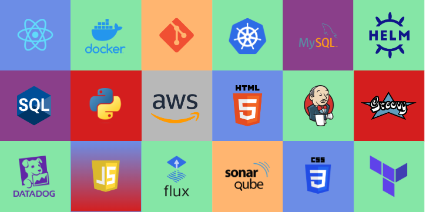

### Greetings!

I'm a DevOps Engineer from Portugal working @xgeeks!

## What have I been working with

## Once upon a time...
Hey, I'm Ricardo!
- I'm figuring it all out, one thing at a time. I enjoy the everyday challenges that arrise at every turn in this crazy, ever-changing IT world.
- Fellow overthinker.
- Trying to enjoy the little things in life.
- :pencil2: Feel like writing a script once in a while. Everything is better wrapped in a good story, right?
- :speech_balloon: Throw me a question, let's chat. 

## Reach out to me!

  
  
  
  

